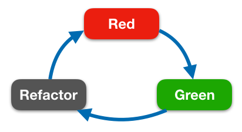

# Occurrences Counter

This project consists of the development of counting the occurrences of words from `The old man and the sea - Ernest Hemingway` textbook.

It will be analysed Pros and Cons of approaches applied to solve the problem by clarifying each one separately. But before to delve into solutions, let's see the process to make the whole application.


## Architecture
Nowadays, iOS developers has several ways to make an application. Among them, one the biggest choice for developers is a proper architecture to exploit for building a product.
Specifically, the most famous architectural patterns are:
- MVC
- MVP
- MVVM
- VIPER

A deep analysis of each one is beyond the scope of this review, but how should developers choose the right architecture for a specific problem?
### Distribution of correct responsibilities among components.
Every software engineer knows what SOLID principles are. The first letter stands for `Single responsibility principle` and it cannot just be a case if the detection of the correct responsibilities is at the top of the designing of an application.

It is a "weapon" to defeat and manage complexity of a product.

### Testability
Separation of concerns has the benefit of making implementations testable. The more data are isolated from the business logic and user interface the more unit tests are straightforward to write.

### Ease of use
Architectures could be very complex in terms of effort and maintenance. Sometimes, making a product more robust than necessary for its intended use is the key for potential issues.

Therefore, patterns like VIPER and MVVM are the best for testability and leveraging single responsibilities but the project could be over-engineered.

Because of the simplicity of the system specifications, the application has been developed by adopting `MVC` as architectural pattern.

This one is fully provided by Apple, and we'll achieve a tradeoff between testability and organisation of the implementation through it.

## Test Driven Development
The application has been developed by using Test Driven Development. 
TDD is a robust design process that allows users to test individual component's behaviour through one unit at a time. Test Driven Development is made up of 3 steps:



### Red
Writing a failing test. In repository you can find several times commits in which a failing test has been written, denoted by a ❌. Most developers overlook this phase, ignoring that the reason why it starts with a failing test and then fix your code to pass it is to avoid a false-positive.

### Green
Fixing the failure created in the previous step by writing just enough code to make the test pass. Commits containing ✅ perform this part of the process. 

### Refactoring
Refactoring pieces of code you are interested in. Most of the time we avoid fixing bad code in our project as it might break the system. 

Through this iterative process, TDD makes developing the initial version of the code a lengthy process, but it is not a waste.
In my opinion, among benefits of Test Driven Development, the cool thing about TDD is to develop the application starting from the top (in the test case codes contain the result of the feature) to the bottom (entire classes, structures and so on so forth); so as the the name itself suggests, tests drive the implementation of features.

## Project solutions
Retrieving occurrences of a word in a text is a common problem in Computer Science.
There are a couple of approach for finding and counting them. They expect a preprocessor phase both, in which the outcome is a valuable sequence of word for counting them. 

This is the task of `Preprocessor` struct.
```swift
struct Prepreprocessor {
    let symbolSkipped = "_,\';?!.:()\\[\\]{}*<>/\""

    func words(from text: String) -> [String] {
        var preprocessingOutcome = text.trimmingCharacters(in: .whitespacesAndNewlines).lowercased()
        
        preprocessingOutcome = preprocessingOutcome.replacingOccurrences(of: "(//'s)|[\(self.symbolSkipped)]", 
                                                                            with: " ", 
                                                                            options: .regularExpression, range: nil)
        
        return preprocessingOutcome.components(separatedBy: .whitespacesAndNewlines)
        }
    }
```
Specifically, it goes through the text for three times:
1. Complete lowercased version of the text
2. Replace symbols to skip with white spaces
3. Produce a sequence of words, having components separated by whitespaces and new lines. 
one for replacing symbol and then for the separation of words by whitespaces and new Lines.

There is no way to complete this task in a more efficient way, just because solutions need to scan the entire file.
Therefore, the complexity in time of the function `words`  is  $`\Omicron(n)`$.


#### Model
Below there are models utilised into the application.
```swift
enum Order {
    case crescent, decrescent

    var description: String {
        switch self {
        case .decrescent:
            return "Decrescent"
        case .crescent:
            return "Crescent"
        }
    }
}
```

```swift
struct WordOccurrence: Hashable {
    let word: String
    let occurrence: Int
    var hashValue: Int {
        return word.hashValue
        }

    static func ==(lhs: WordOccurrence, rhs: WordOccurrence) -> Bool {
        return lhs.word == rhs.word
    }
}
```
As you can see, WordOccurrence implements the `Hashable` protocol in order to be supported from data structures which have Hashable elements (e.g. dictionaries and sets).

### Word-Occurrence Management

Once preprocessing has been done, `WordOccurrenceManager` comes into play. Concretely, it is a protocol that exposes functions.
```swift
protocol WordOccurrenceManager {
    init(text: String)
    func occurrences() -> Set<WordOccurrence>
    func occurrences(with order: Order) -> [WordOccurrence]
}
```
Solutions have one-to-one relationship with each concrete implementation of the interface above, hence let's go deeper by analysing them individually.

#### WordOccurrenceReducer

The reason why Preprocessor has been introduced before any other entities is simply because the manager uses it to enable preprocessing as first action.

The following code is the implementation of our manager:
```swift
final class WordOccurrenceReducer: WordOccurrenceManager {
    private let text: String
    
    private lazy var occurrencesSet: Set<WordOccurrence> = {
    self.calculateOccurrences(from: self.text)
    }()

    private lazy var occurrencesCrescent: [WordOccurrence] = {
        return self.occurrencesSet.sorted { $0.occurrence < $1.occurrence }
    }()

    private lazy var occurrencesDecrescent: [WordOccurrence] = {
        return self.occurrencesSet.sorted { $0.occurrence > $1.occurrence }
    }()

    init(text: String) {
        self.text = text
    }

    // MARK: Public functions
    func occurrences() -> Set<WordOccurrence> {
        return self.occurrencesSet
    }

    func occurrences(with order: Order) -> [WordOccurrence] {
        let orderedOccurrences: [WordOccurrence]
        switch order {    
        case .crescent:
            orderedOccurrences = self.occurencesCrescent
        case .decrescent:
            orderedOccurrences = self.occurencesDecrescent
        }

    return orderedOccurrences
    }

    // MARK: Private functions
    private func calculateOccurrences(from text: String) -> Set<WordOccurrence> {
        let words = Prepreprocessor().words(from: text)
        let dictionary = self.map(from: words)
        var result = Set<WordOccurrence>()
        dictionary.forEach { word, occurrence in
            let wordOccurrences = WordOccurrence(word: word, occurrence: occurrence)
            result.insert(wordOccurrences)
        }

        return result
    }

    private func map(from words: [String]) -> [String: Int] {
        return words.reduce(into: [:]) { counts, word in
            if !word.isEmpty {
                counts[word, default: 0] += 1
            }
        }
    }
}
``` 
Essentially, the are two public functions:
-  `occurrences() -> Set<WordOccurrence>`
-  `occurrences(with order: Order) -> [WordOccurrence]`

They mainly differ in the given outcome. Indeed, they give as result:
- An unordered set
- A sequence ordered by the input `Order`.

The core of the manager lives in its private functions.Firstly, let's focus our attention on:

```swift
final class WordOccurrenceReducer: WordOccurrenceManager {
...
// code above

    // MARK: Private functions
    private func calculateOccurrences(from text: String) -> Set<WordOccurrence>  { 
        let words = Prepreprocessor().words(from: text)  
        let dictionary = self.map(from: words)              
        var result = Set<WordOccurrence>()
        dictionary.forEach { word, occurrence in  
            let wordOccurrences = WordOccurrence(word: word, occurrence: occurrence)          
            result.insert(wordOccurrences)  
            }

        return result 
    }

    private func map(from words: [String]) -> [String:  Int] { 
        return words.reduce(into:  [:])  { counts, word in  
            if  !word.isEmpty  { 
                counts[word,  default:  0]  +=  1  
            }      
        }  
    }
```

It can be decomposed in:
1. Text Preprocessing
2. Calculate occurrences for words reducing the sequence given from the `Preprocessor`. This task is performed from the private `map` function.
3.  Since the outcome from the previous step is a  `[String: Int]` Dictionary, it's transformed to a Set properly. It should be more clear why `WordOccurrence` needs to be conform to Hashable.

The complexity in time to have occurrences by word is $`\Omicron(n)`$. In fact, each step has a linear complexity in time. 

1. Complexity in time has been discussed in words function of Preprocessor.
2. The private `map` function uses the `reduce`  and , as written in the Apple Documentation, it has a linear complexity in time.
3. Converting a dictionary to another one requires to read whole keys, so it's $`\Omicron(n)`$ too.

Since a manager handles a single text, we can store the set in an instance variable in order to avoid recalculating occurrences each time.

And last but not least, let's talk about order.
The application could request to have an ordered sequence instead of a set. This is captured in the following bunch of code:

```swift
final class WordOccurrenceReducer: WordOccurrenceManager {
    private let text: String
    
    private lazy var occurrencesSet: Set<WordOccurrence> = {
        self.calculateOccurrences(from: self.text)
    }()

    private lazy var occurrencesCrescent: [WordOccurrence] = {
        return self.occurrencesSet.sorted { $0.occurrence < $1.occurrence }
    }()

    private lazy var occurrencesDecrescent: [WordOccurrence] = {
        return self.occurrencesSet.sorted { $0.occurrence > $1.occurrence }
    }()

    init(text: String) {
        self.text = text
    }

    // MARK: Public functions
    ....
    // other code

    func occurrences(with order: Order) -> [WordOccurrence] {
        let orderedOccurrences: [WordOccurrence]
        switch order {    
        case .crescent:
            orderedOccurrences = self.occurrencesCrescent
        case .decrescent:
            orderedOccurrences = self.occurrencesDecrescent
        }

        return orderedOccurrences
    }

    ...
    // other code
}
```
In few words, it starts by invoking `occurrences(with order: Order)` .
Depending on the input parameter, the manager stores the proper sorting in two different variables, one for the each order. This approach allows to calculate one time a crescent or decrescent version of the words set, and it could be considered an optimisation. 

This is the main solution reputed as more elegant than others adopted to solve the problem. Higher-order functions contribute to have less and understandable code. 
